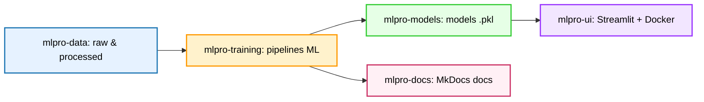

# ⚠️ **Attention : ce dépôt spécial `.github` ne contient pas de code.**  

Il sert uniquement à afficher la page d’accueil de l’organisation [mlpro-org](https://github.com/mlpro-org).  
Les projets réels sont organisés en dépôts indépendants (voir ci-dessous).

# 📂 Description de l'organisation "mlpro-org" en MultiRepo pour développer les projets de Machine Learning
 
## 🟥 Projet MLPRO – MultiRepo 
Ce dépôt est le **hub principal** MultiRepo qui contient les projets de Machine Learning par exemple:
**Bank Churn 2025**
**Houses Prices 2025** etc. 

Il est organisé en **MultiRepo** sous l’organisation [mlpro-org](https://github.com/mlpro-org).

L’objectif est à partir des données Kaggle en suivant une démarche complète de Machine Learning :  

➡️ Analyse exploratoire → Pipeline ML → Entraînement de modèles → Déploiement d’une UI → Documentation de structurer les projets ML en MultiRepo pour pouvoir réutiliser facilement des scipts ou autres applications développées d'un projet à l'autre. Le MultiRepo s'appuie sur les dépots et la structure architecturale suivants

## 🔗 Dépôts du projet

- 📊 [mlpro-data](https://github.com/mlpro-org/mlpro-data)  
  Ingestion et préparation des données (raw → processed).

- 🤖 [mlpro-training](https://github.com/mlpro-org/mlpro-training)  
  Pipelines d’entraînement, feature engineering et suivi des métriques.

- 📦 [mlpro-models](https://github.com/mlpro-org/mlpro-models)  
  Stockage et versionnage des modèles validés (`.pkl` + model-cards).

- 🖥️ [mlpro-ui](https://github.com/mlpro-org/mlpro-ui)  
  Application Streamlit (prédictions individuelles et batch via CSV).

- 📚 [mlpro-docs](https://github.com/mlpro-org/mlpro-docs)  
  Documentation technique et utilisateur (MkDocs + Material).

## 🏗️ Stack technique
- **Langage** : Python 3.11  
- **Frameworks ML** : Scikit-learn, XGBoost, LightGBM, CatBoost  
- **UI** : Streamlit + Docker  
- **Documentation** : MkDocs Material  
- **CI/CD** : GitHub Actions (tests, Docker build, docs deploy)

## 📂 Organisation des répertoires (multi-repo)

mlpro-org/ # Repo hub (décrit dans ce fichier README)
├── mlpro-data/ # Données (brutes, transformées, logs)
├── mlpro-training/ # Pipelines ML, entraînements, résultats
├── mlpro-models/ # Modèles sauvegardés et cards YAML
├── mlpro-ui/ # Application Streamlit / Docker
└── mlpro-docs/ # Documentation centralisée

## 📂 Architecture des répertoires (multi-repo)( Mermaid)

## 🎯 Objectif du MultiRepo
- Construire une chaîne **de bout en bout** : data → modèle → app → doc.  
- Mettre en place une structure **réutilisable** pour d’autres projets de Machine Learning MLPRO.  
- Adopter des bonnes pratiques **MLOps** : versionning, reproductibilité, CI/CD.  

## 🧑 Auteur
Projet dévelpppé par **Jean Kubiak** dans le cadre de la formation *Machine Learnia (Guillaume Saint-Cirgue)*.  
Organisation GitHub : [mlpro-org](https://github.com/mlpro-org)
